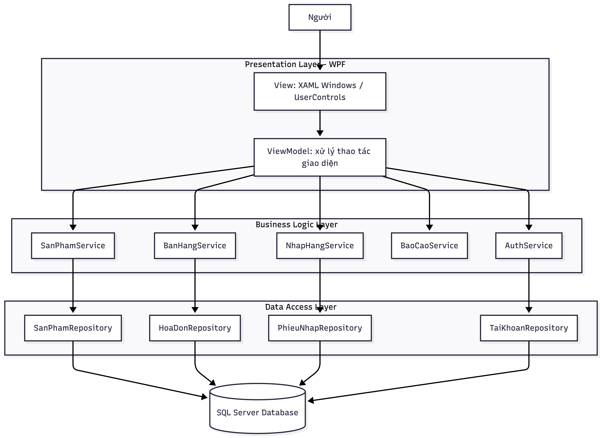
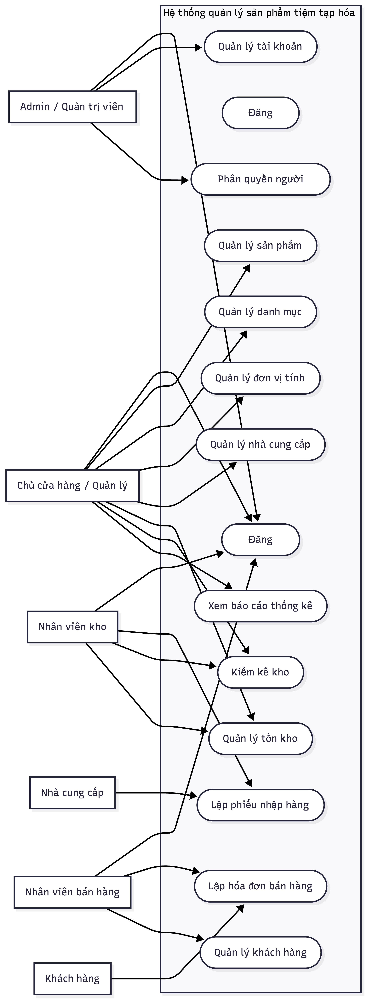
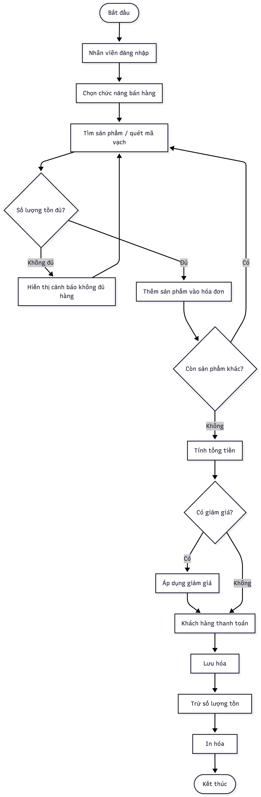
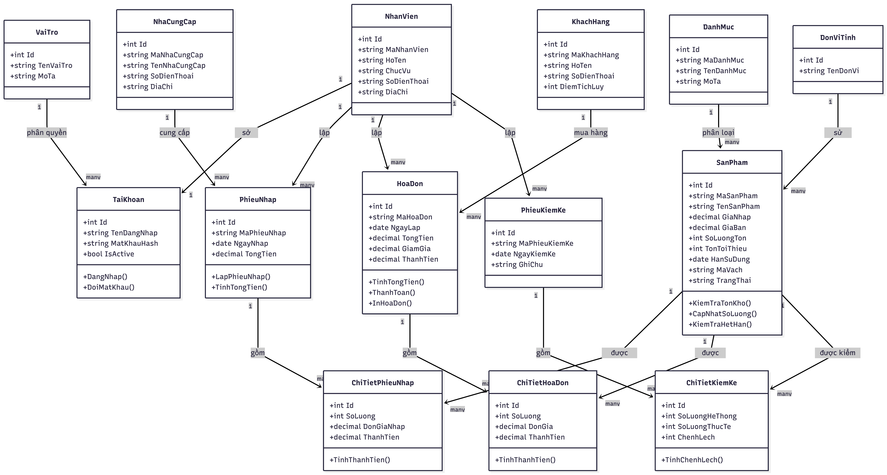

# Hệ Thống Quản Lý Hàng Tạp Hóa

Đây là project bài tập lớn môn Kỹ thuật phần mềm và ứng dụng với đề tài **Hệ thống quản lý hàng tạp hóa**.

Project được xây dựng theo:

- Ngôn ngữ: C# .NET
- Giao diện: WPF
- Mô hình giao diện: MVVM
- Cơ sở dữ liệu: Microsoft SQL Server
- Kết nối database: ADO.NET
- Kiến trúc: 3-Layer Architecture
- IDE khuyến nghị: Visual Studio 2022 trên Windows

## 1. Cấu Trúc Project

```text
GroceryStoreManagement/
  GroceryStoreManagement.sln
  Directory.Build.props
  README.md
  .gitignore

  GroceryStoreManagement.Models/
    Các class model: SanPham, HoaDon, PhieuNhap, KhachHang...

  GroceryStoreManagement.DAL/
    Database/
      DbConnectionFactory.cs
    Repositories/
      Các repository truy vấn SQL Server bằng ADO.NET

  GroceryStoreManagement.BLL/
    Services/
      AuthService, SanPhamService, BanHangService, NhapHangService...

  GroceryStoreManagement.Presentation/
    App.xaml
    Commands/
    ViewModels/
    Views/

  database/
    GroceryStoreManagement.sql

  docs/
    images/
      Các ảnh sơ đồ UML, ERD và kiến trúc
    UML_Mermaid.md
    BaoCao_BaiTapLon.md
```

## 2. Các Thành Phần Chính

- `GroceryStoreManagement.Models`: chứa các lớp dữ liệu dùng chung.
- `GroceryStoreManagement.DAL`: tầng truy cập dữ liệu, dùng ADO.NET và SQL Server.
- `GroceryStoreManagement.BLL`: tầng xử lý nghiệp vụ.
- `GroceryStoreManagement.Presentation`: tầng giao diện WPF theo MVVM.
- `database/GroceryStoreManagement.sql`: script tạo database, bảng, khóa chính, khóa ngoại, ràng buộc và dữ liệu mẫu.
- `docs/UML_Mermaid.md`: mã Mermaid cho các sơ đồ UML/ERD.
- `docs/BaoCao_BaiTapLon.md`: nội dung báo cáo bài tập lớn.
- `docs/images/`: các ảnh sơ đồ phân tích thiết kế dùng trong báo cáo và README.

## 3. Yêu Cầu Cài Đặt Trên Máy Windows

Cài các phần mềm sau:

1. **Visual Studio 2022**
2. Workload **.NET Desktop Development**
3. **.NET 8 SDK**
4. **SQL Server** hoặc **SQL Server LocalDB**
5. **SQL Server Management Studio** để chạy script database
6. Git, nếu clone project từ GitHub

Khi cài Visual Studio, nhớ tích workload:

```text
.NET Desktop Development
```

Workload này cần thiết để build và chạy WPF.

## 4. Cách Push Project Lên GitHub

Mở Terminal tại thư mục `GroceryStoreManagement`, sau đó chạy:

```bash
git init
git add .
git commit -m "Initial grocery store management project"
git branch -M main
git remote add origin https://github.com/<username>/<repository-name>.git
git push -u origin main
```

Thay:

```text
<username>
<repository-name>
```

bằng tài khoản GitHub và tên repository thật của bạn.

Nếu repository đã có sẵn remote rồi thì chỉ cần:

```bash
git add .
git commit -m "Update project"
git push
```

## 5. Cách Clone Về Máy Windows

Trên máy Windows, mở Terminal hoặc Git Bash:

```bash
git clone https://github.com/<username>/<repository-name>.git
cd <repository-name>
```

Nếu bạn push nguyên thư mục cha, hãy đi vào thư mục project:

```bash
cd GroceryStoreManagement
```

Sau đó mở file:

```text
GroceryStoreManagement.sln
```

bằng Visual Studio 2022.

## 6. Tạo Database SQL Server

1. Mở **SQL Server Management Studio**.
2. Kết nối đến SQL Server hoặc LocalDB.
3. Mở file:

   ```text
   database/GroceryStoreManagement.sql
   ```

4. Chạy toàn bộ script.
5. Sau khi chạy xong sẽ có database:

   ```text
   GroceryStoreManagement
   ```

Script đã bao gồm:

- `CREATE DATABASE`
- `CREATE TABLE`
- `PRIMARY KEY`
- `FOREIGN KEY`
- `UNIQUE`
- `CHECK`
- `DEFAULT`
- dữ liệu mẫu
- một số câu `SELECT` kiểm thử

## 7. Cấu Hình Chuỗi Kết Nối

Mở file:

```text
GroceryStoreManagement.Presentation/App.xaml.cs
```

Chuỗi kết nối mặc định:

```csharp
@"Server=(localdb)\MSSQLLocalDB;Database=GroceryStoreManagement;Trusted_Connection=True;TrustServerCertificate=True;"
```

Nếu máy Windows dùng SQL Server LocalDB thì thường không cần sửa.

Nếu dùng SQL Server Express, có thể đổi thành:

```csharp
@"Server=.\SQLEXPRESS;Database=GroceryStoreManagement;Trusted_Connection=True;TrustServerCertificate=True;"
```

Nếu dùng SQL Server instance khác, đổi phần `Server=...` cho đúng tên server trên máy bạn.

Ví dụ:

```csharp
@"Server=localhost;Database=GroceryStoreManagement;Trusted_Connection=True;TrustServerCertificate=True;"
```

hoặc:

```csharp
@"Server=DESKTOP-ABC123;Database=GroceryStoreManagement;Trusted_Connection=True;TrustServerCertificate=True;"
```

## 8. Chạy Ứng Dụng Trong Visual Studio

1. Mở `GroceryStoreManagement.sln`.
2. Trong Solution Explorer, bấm chuột phải vào project:

   ```text
   GroceryStoreManagement.Presentation
   ```

3. Chọn:

   ```text
   Set as Startup Project
   ```

4. Chọn cấu hình:

   ```text
   Debug
   Any CPU
   ```

5. Bấm:

   ```text
   Build > Build Solution
   ```

6. Nếu build thành công, bấm:

   ```text
   Start
   ```

hoặc nhấn `F5`.

## 9. Tài Khoản Đăng Nhập Mẫu

Mật khẩu mặc định của tất cả tài khoản mẫu là:

```text
123456
```

| Tài khoản | Vai trò |
| --- | --- |
| `admin` | Admin |
| `quanly` | Quản lý |
| `kho` | Nhân viên kho |
| `banhang` | Nhân viên bán hàng |

## 10. Các Chức Năng Đã Có

- Đăng nhập hệ thống.
- Ghi lịch sử truy cập.
- Dashboard tổng quan.
- Quản lý sản phẩm.
- Tìm kiếm sản phẩm theo mã, tên hoặc mã vạch.
- Lọc sản phẩm theo danh mục.
- Cảnh báo tồn kho thấp.
- Cảnh báo sản phẩm sắp hết hạn.
- Lập phiếu nhập hàng.
- Cập nhật tồn kho khi nhập hàng.
- Lập hóa đơn bán hàng.
- Kiểm tra tồn kho trước khi bán.
- Cập nhật tồn kho khi bán hàng.
- Quản lý khách hàng.
- Kiểm kê kho.
- Báo cáo doanh thu, tồn kho thấp, sản phẩm sắp hết hạn và sản phẩm bán chạy.

## 11. Luồng Kiến Trúc

Ứng dụng đi theo luồng:

```text
User
  -> WPF View
  -> ViewModel
  -> BLL Service
  -> DAL Repository
  -> SQL Server
```

Ví dụ quy trình bán hàng:

```text
BanHangView
  -> BanHangViewModel
  -> BanHangService
  -> HoaDonRepository / SanPhamRepository
  -> SQL Server
```

Ví dụ quy trình nhập hàng:

```text
NhapHangView
  -> NhapHangViewModel
  -> NhapHangService
  -> PhieuNhapRepository
  -> SQL Server
```

## 12. Sơ Đồ Phân Tích Thiết Kế

Các ảnh sơ đồ trong thư mục `docs/images/` có liên hệ trực tiếp với project. Đây là phần phân tích thiết kế của hệ thống, nên **nên push lên GitHub cùng mã nguồn** để người xem hiểu kiến trúc, database và luồng nghiệp vụ.

### Kiến trúc hệ thống



### Use Case

| Sơ đồ | File |
| --- | --- |
| Use Case tổng quát | [use-case-overview.png](docs/images/use-case-overview.png) |
| Use Case đăng nhập | [use-case-login.png](docs/images/use-case-login.png) |
| Use Case quản lý sản phẩm | [use-case-product-management.png](docs/images/use-case-product-management.png) |
| Use Case lập phiếu bán hàng | [use-case-sales-slip.png](docs/images/use-case-sales-slip.png) |
| Use Case lập hóa đơn bán hàng | [use-case-sales-invoice.png](docs/images/use-case-sales-invoice.png) |



### Activity Diagram

| Sơ đồ | File |
| --- | --- |
| Quy trình bán hàng | [activity-sales-process.png](docs/images/activity-sales-process.png) |
| Quy trình nhập hàng | [activity-import-process.png](docs/images/activity-import-process.png) |



### Sequence Diagram

| Sơ đồ | File |
| --- | --- |
| Quy trình bán hàng | [sequence-sales-process.png](docs/images/sequence-sales-process.png) |
| Quy trình nhập hàng | [sequence-import-process.png](docs/images/sequence-import-process.png) |


### Class Diagram Và ERD

| Sơ đồ | File |
| --- | --- |
| Class Diagram | [class-diagram.png](docs/images/class-diagram.png) |
| ERD tổng quát | [erd-overview.png](docs/images/erd-overview.png) |
| ERD chi tiết | [erd-detail.png](docs/images/erd-detail.png) |




## 13. Lỗi Thường Gặp Khi Chạy

### Lỗi không mở được project WPF

Nguyên nhân thường là chưa cài workload `.NET Desktop Development`.

Cách sửa:

1. Mở Visual Studio Installer.
2. Chọn Modify.
3. Tích `.NET Desktop Development`.
4. Cài đặt xong rồi mở lại solution.

### Lỗi không tìm thấy .NET SDK

Project target `.NET 8`. Cài .NET 8 SDK hoặc dùng Visual Studio 2022 bản mới.

### Lỗi kết nối database

Kiểm tra:

- SQL Server đã chạy chưa.
- Đã chạy script `GroceryStoreManagement.sql` chưa.
- Tên server trong connection string đã đúng chưa.

Nếu dùng SQL Server Express, thử:

```csharp
Server=.\SQLEXPRESS
```

Nếu dùng LocalDB, thử:

```csharp
Server=(localdb)\MSSQLLocalDB
```

### Đăng nhập báo sai tài khoản

Kiểm tra đã chạy script database chưa. Script có sẵn các tài khoản mẫu `admin`, `quanly`, `kho`, `banhang`.

### Clone về nhưng thiếu file build

Đây là bình thường. Các thư mục `bin/` và `obj/` không cần push lên GitHub. Visual Studio sẽ tự tạo lại khi build.

## 14. Ghi Chú Cho Người Chấm Hoặc Người Test

- Mở `GroceryStoreManagement.sln` bằng Visual Studio 2022 trên Windows.
- Chạy database trước bằng file `database/GroceryStoreManagement.sql`.
- Kiểm tra connection string trong `App.xaml.cs`.
- Startup Project là `GroceryStoreManagement.Presentation`.
- Tài khoản test nhanh: `admin / 123456`.

## 15. Tài Liệu Đi Kèm

Các tài liệu phân tích thiết kế nằm trong thư mục `docs/`:

- `BaoCao_BaiTapLon.md`
- `UML_Mermaid.md`
- `images/`
