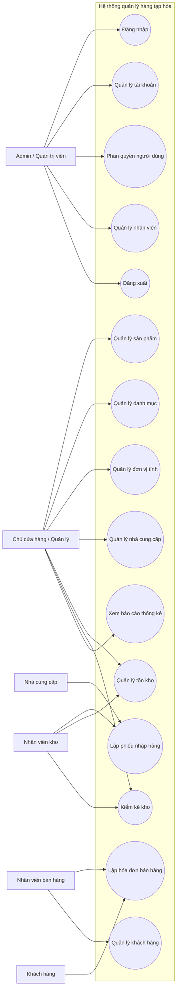
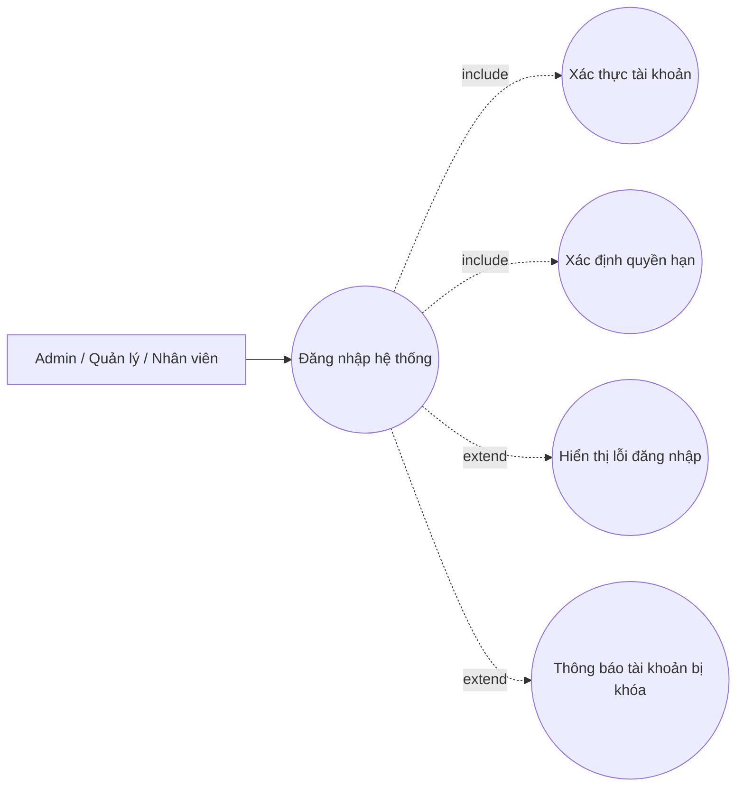
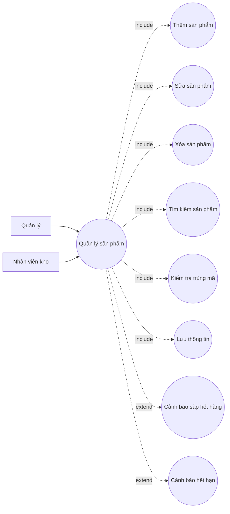
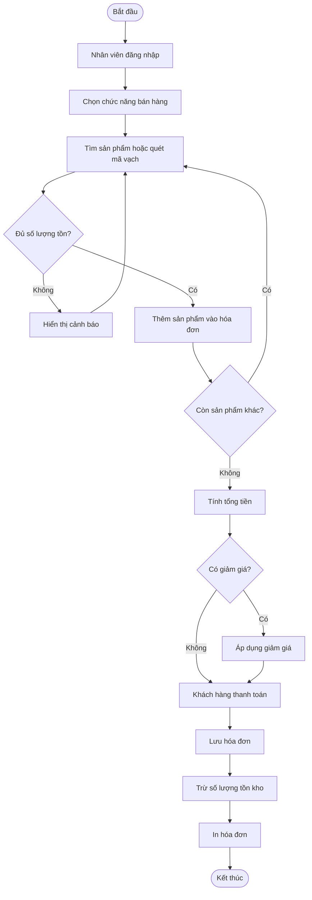
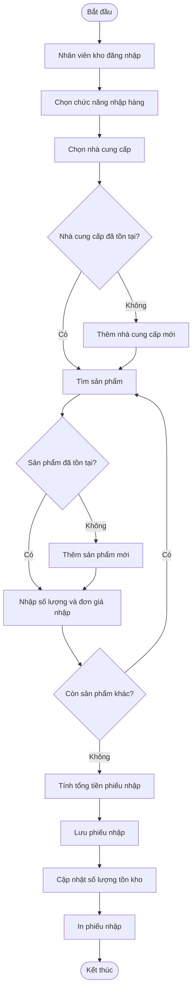
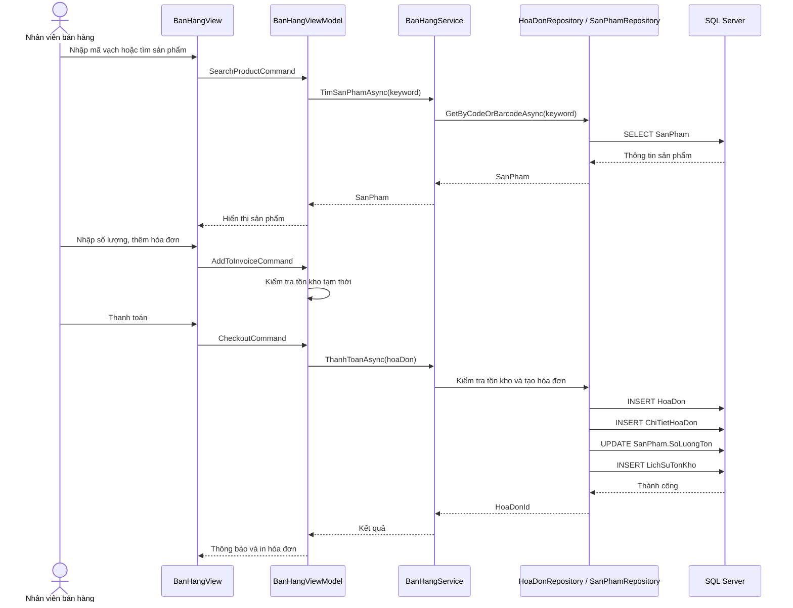
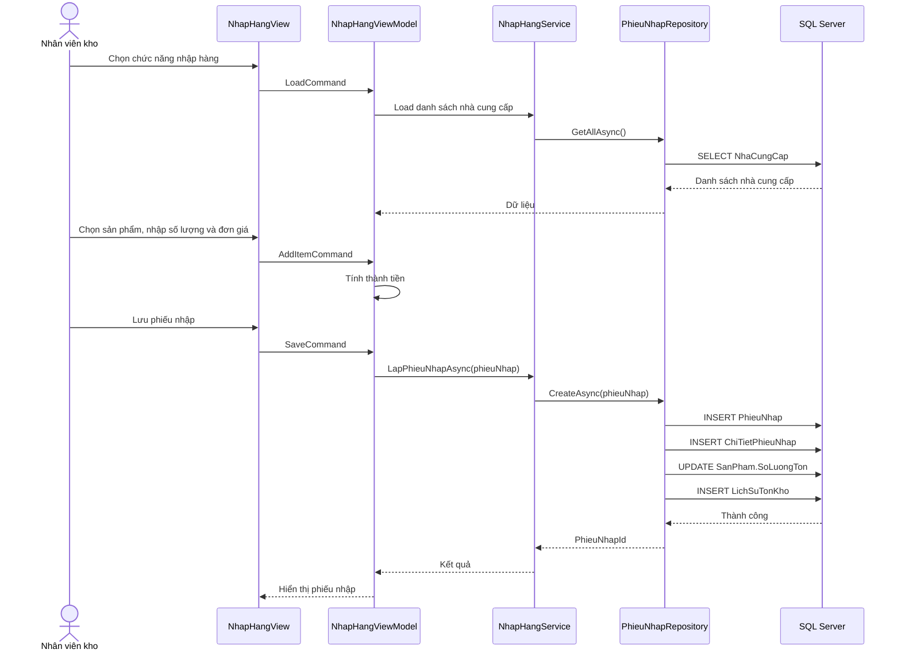
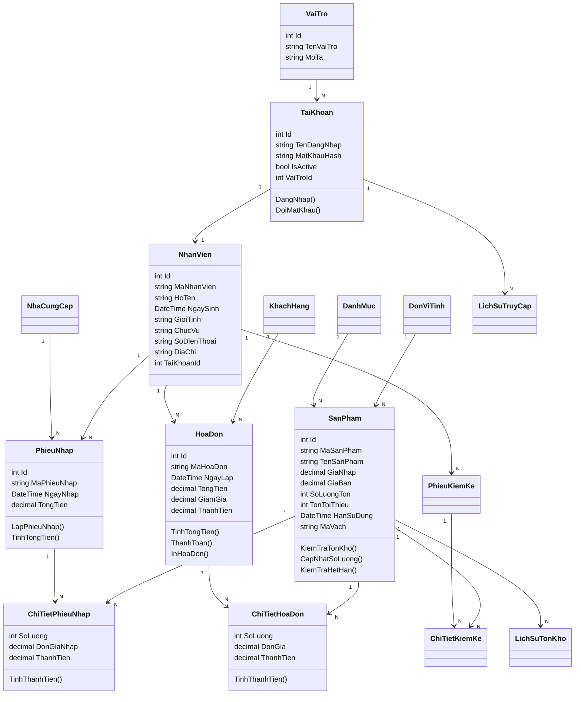
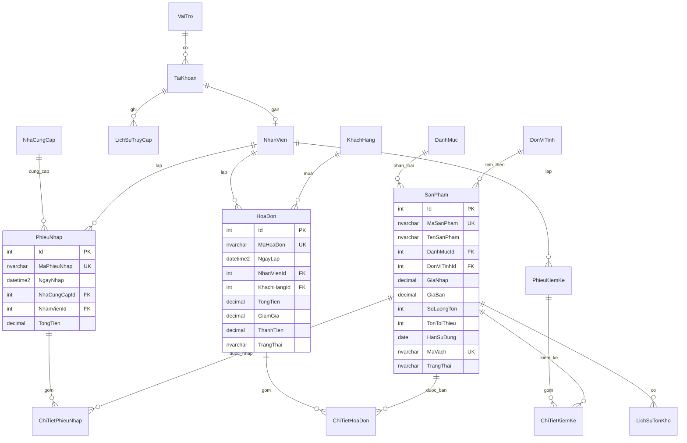

# UML và ERD Mermaid

Tài liệu này cung cấp Mermaid code để chèn vào báo cáo hoặc render lại sơ đồ. Trong thư mục gốc cũng đã có các file ảnh PNG của Use Case, Activity, Sequence, Class Diagram và ERD.

## Use Case Tổng Quát

## Use Case Chi Tiết: Đăng Nhập

## Use Case Chi Tiết: Quản Lý Sản Phẩm

## Activity Diagram: Quy Trình Bán Hàng

## Activity Diagram: Quy Trình Nhập Hàng

## Sequence Diagram: Quy Trình Bán Hàng

## Sequence Diagram: Quy Trình Nhập Hàng

## Class Diagram

## ERD Chi Tiết

